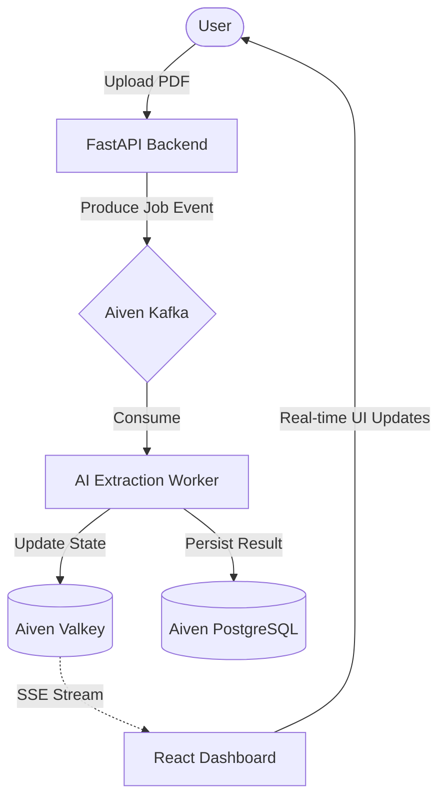

# Aiven Doc-Processor


A high-performance, real-time logistics document extraction dashboard powered by **Aiven for Apache Kafka**, **PostgreSQL**, and **Valkey**.

This application demonstrates a complete event-driven pipeline where uploaded PDFs are processed by an AI worker, with every stage streamed to the UI in real-time.

## 📺 Live Walkthrough


<div align="center">
  <video width="100%" src="src/assets/aiven-doc-processing-walkthrough.mp4" controls muted autoplay loop></video>
</div>

<br/>

---

## 🏗️ Architecture



### The Pipeline
1.  **Ingestion**: User uploads a PDF (Invoice, BOL, etc.) via the React dashboard.
2.  **Messaging**: FastAPI pushes a `job.started` event to **Aiven Kafka**.
3.  **Processing**: A background worker consumes the event and performs OCR/Extraction.
4.  **State Management**: Real-time stage updates (Queued, Processing, Cleanup) are cached in **Aiven Valkey** for low-latency streaming.
5.  **Persistence**: Final extracted JSON payloads are stored in **Aiven PostgreSQL** for durable history.
6.  **Streaming**: The UI connects via Server-Sent Events (SSE) to provide an "instant" feel.

---

## 🚀 Getting Started

### Prerequisites
- Node.js (v18+)
- A running backend (see [backend repository](#))

### Installation

1.  Clone the repository:
    ```bash
    git clone https://github.com/your-org/aiven-doc-processing.git
    cd aiven-doc-processing
    ```

2.  Install dependencies:
    ```bash
    npm install
    ```

3.  Configure environment variables:
    ```bash
    cp .env.example .env
    ```
    *(Note: On Windows, use `copy .env.example .env`)*

4.  Start the development server:
    ```bash
    npm run dev
    ```

The Vite dev server will proxy `/api` requests to `http://127.0.0.1:8000` by default.

### Environment Variables

Configure these in your `.env` file:

| Variable | Default | Description |
| :--- | :--- | :--- |
| `VITE_API_PROXY_TARGET` | `http://127.0.0.1:8000` | Target URL for the backend API proxy |

---

## 🛠️ Tech Stack

- **Frontend**: React 19, Vite 8, Tailwind CSS v4.
- **Data Streaming**: Aiven for Apache Kafka.
- **Database**: Aiven for PostgreSQL.
- **Cache/State**: Aiven for Valkey.
- **Real-time**: Server-Sent Events (SSE).

---

## 🤝 Contributing

Contributions are welcome! Please feel free to submit a Pull Request.

## 📄 License

Distributed under the MIT License. See `LICENSE` for more information.
